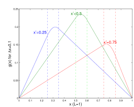
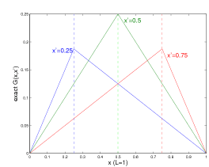

# 18.303 Fall 2010 - Linear Partial Differential Equations

Fall 2010, Prof. [Steven G. Johnson](http://math.mit.edu/~stevenj/), Dept. of Mathematics.

Overview
--------

This is the home page for the 18.303 course at MIT in Fall 2010, where the syllabus, lecture materials, problem sets, and other miscellanea are posted.

You can also download the [course announcement flyer](18.303-flyer.pdf). This course was previously offered as [18.303 by Prof. Freedman](http://math.mit.edu/classes/18.303/) (also [on OpenCourseWare](http://ocw.mit.edu/OcwWeb/Mathematics/18-303Fall-2006/CourseHome/index.htm)), but the content and focus of the previous 18.303 differs substantially from this one.

> **Course description**
>
> _Provides students with the basic analytical and computational tools of linear partial differential equations (PDEs) for practical applications in science engineering, including heat/diffusion, wave, and Poisson equations. Analytics emphasize the viewpoint of linear algebra and the analogy with finite matrix problems. Studies operator adjoints and eigenproblems, series solutions, Green's functions, and separation of variables. Numerics focus on finite-difference and finite-element techniques to reduce PDEs to matrix problems, including stability and convergence analysis and implicit/explicit timestepping. MATLAB is introduced and used in homework for simple examples._
>
> Prerequisite: linear algebra ([18.06](http://web.mit.edu/18.06), 18.700, or equivalent).

Syllabus
--------

**Lectures**: MWF 1–2pm (2-147). **Office Hours:** Tues. 4:30–5:30 (2-388). **TA Office Hours:** Thurs. 1–2pm (2-229).

**Grading**: 50% homework, 20% mid-term (Nov. 3), 30% final exam (Dec. 15, 9am-noon, 32-144). Problem sets are **due in class** on the due date, no excuses, but your lowest pset score will be dropped at the end of the term.

**Books**: [_Computational Science and Engineering_](http://math.mit.edu/cse/) by Strang is a recommended but not required text (emphasizing more the numerical part of the course).

**TA:** [Tim Nguyen](http://math.mit.edu/people/profile.php?pid=197)

* * *

Lecture Summaries and Handouts
------------------------------

### Lecture 1: 8 September 2010

**Handouts:** syllabus (this web page), [Lecture 1 notes](Lecture1.pdf), [pset 1](pset1-f10.pdf) (due Wed. 15 September).

General overview of what a PDE is and why they are important. Discussed examples of some typical and important PDEs (see handout, page 1). With non-constant coefficients (the most common case in real-world physics and engineering), even the simplest PDEs are rarely solvable by hand; even with constant coefficients, only a relative handful of cases are solvable, usually high-symmetry cases (spheres, cylinders, etc.) solvable. Therefore, although we will solve a few simple cases by hand in 18.303, the emphasis will instead be on two things: learning to _think_ about PDEs by recognizing how their _structure_ relates to concepts from finite-dimensional linear algebra (matrices), and learning to _approximate_ PDEs by actual matrices in order to solve them on computers.

Went through 2nd page of handout, comparing a number of concepts in finite-dimensional linear algebra (ala 18.06) with linear PDEs (18.303). The things in the "18.06" column of the handout should already be familiar to you (although you may need to review a bit if it's been a while since you took 18.06)—this is the kind of thing I care about from 18.06 for this course, not how good you are at Gaussian elimination or solving 2×2 eigenproblems by hand. The things in the "18.303" column are perhaps unfamiliar to you, and some of the relationships may not be clear at all: what is the dot product of two functions, or the transpose of a derivative, or the inverse of a derivative operator? Unraveling and elucidating these relationships will occupy a large part of this course.

**Note:** Just as in 18.06, for as long as possible I will stick with real numbers and real functions, but at some point complex numbers will become hard to avoid. When that happens, we will have to switch from transposes AT to conjugate-transposes A\*.

### Lecture 2: 10 September 2010

**Handouts:** [Fourier sine series examples](http://web.mit.edu/18.06/www/Spring09/sines.pdf)

Started with a very simple vector space V of functions: functions u(x) on \[0,L\] with u(0)=u(L)=0 (Dirichlet boundary conditions), and with one of the simplest operators: the 1d Laplacian A=d2/dx2. Explained how this describes some simple problems like a stretched string, 1d electrostatic problems, and heat flow between two reservoirs.

Inspired by 18.06, we begin by asking what the null space of A is, and we quickly see that it is {0}. Thus, any solution to Au=f must be unique. We then ask what the eigenfunctions are, and quickly see that they are sin(nπx/L) with eigenvalues -(nπ/L)2. If we can expand functions in this basis, then we can treat A as a number, just like in 18.06, and solve lots of problems easily. Such an expansion is precisely a Fourier sine series (see handout).

In terms of sine series for f(x), solve Au=f (Poisson's equation) and Au=∂u/∂t with u(x,0)=f(x) (heat equation). In the latter case, we immediately see that the solutions are decaying, and that the high-frequency terms decay faster...eventually, no matter how complicated the initial condition, it will eventually be dominated by the smallest-n nonzero term in the series (usually n=1). Physically, diffusion processes like this smooth out oscillations, and nonuniformities eventually decay away.

Using a simple Matlab script to sum the Fourier sine series, animated solutions to the heat equation in a couple of cases, seeing exactly what we expected.

As a preview of things to come later, by a simple change to the time-dependence found a solution to the wave equation Au=∂2u/∂t2 from the same sine series, and animated that to see "wavelike" behavior. (This is an instance of what we will later call a "separation of variables" technique.)

**Further reading:** Section 4.1 of the book (Fourier series and solutions to the heat equation).

### Lecture 3: 13 September 2010

**Handouts:** [notes on difference approximations](difference-approx.pdf)

Began with a warning: functions are more complicated than vectors, and it is possible to come up with crazy counter-example functions where 18.06-like techniques don't work, if you try. Gave examples of a function lacking a sine series and a function where the sine series obviously does not converge to the right result. Much of a rigorous pure-math course, like a course on functional analysis, has to do with carefully circumscribing the set of functions and operators that will be considered, in order to exclude the pathological cases that don't resemble finite vectors and matrices.

Now, we will go back to the happy land of finite-ness for a while, by learning to approximate a PDE by a matrix. This will not only give us a way to compute things we cannot solve by hand, but it will also give us a different perspective on certain properties of the solutions that may make certain abstract concepts of the PDE clearer. We begin with one of the simplest numerical methods: we replace the continuous space by a grid, the function by the values on a grid, and derivatives by differences on the grid. This is called a **finite-difference method**.

Went over the basic concepts and accuracy of approximating derivatives by differences; see handout.

Armed with center differences (see handout), went about approximating the 1d Laplacian operator d2/dx2 by a matrix, resulting in a famous tridiagonal matrix known as a _discrete Laplacian_. The properties of this matrix will mirror many properties of the underlying PDE, but in a more familiar context.

**Further reading:** chapter 1 of the book, especially section 1.2 on finite differences.

### Lecture 4: 15 September 2010

**Handouts:** [Matlab cheat sheet](http://web.mit.edu/18.06/www/Spring09/matlab-cheatsheet.pdf) from 18.06, [pset 2](pset2-f10.pdf) (due Wed 22 Sep; see also Matlab file [diff1.m](diff1.m)); [pset 1 solutions](pset1sol-f10)

Compared the 1d Laplacian to its discrete approximation. Both have real, negative eigenvalues, both have orthogonal eigenvectors/eigenfunctions. In the discrete Laplacian, the real eigenvalues and the orthogonal eigenvectors stem from the fact that it is (obviously) real-symmetric; the same fact also implies that it is diagonalizable (complete basis of eigenvectors). The Laplacian is not (yet) obviously real-symmetric, whatever that means for a derivative, but it is "diagonalizable-ish"; its eigenfunctions span anything with a Fourier sine series (i.e. anything that does not diverge too quickly), as long as we ignore finite errors at isolated points of discontinuity. (Pinning down diagonalizability of differential operators is a difficult topic, one that requires half a functional analysis course even for relatively simple cases.)

The negative eigenvalues mean that the discrete Laplacian is negative definite, and also suggest that it can be written in the form -DTD for some D. Show that this is indeed the case: we derived the discrete Laplacian by turning two derivatives into differences, one by one, by writing the first step as a matrix we get D, and writing the second step as a matrix shows that it is -DT. Reviewed the proof that this means the matrix is negative definite, which also relies on D being full column rank (which is easy to see from DT since it is upper-triangular).

To do a similar analysis of the actual Laplacian, we first have to have a dot product, or inner product. Defined an abstract ⟨u,v⟩ notation for inner products, as well as three key properties. First, ⟨u,v⟩ = complex conjugate of ⟨v,u⟩. Second, |u|2\=⟨u,u⟩ must be nonnegative, and zero only if u=0. Third, it must be linear: ⟨u,αv+βw⟩=α⟨u,v⟩+β⟨u,w⟩ (note: some textbooks, especially in functional analysis, put the conjugation on the second argument instead of the first). For functions, the most common inner product (though not the only choice, as you will see in pset 2) is a simple integral; we will look at this more next time.

### Lecture 5: 17 September 2010

Reviewed inner products of functions. A vector space with an inner product (plus a technical criterion called "completeness" that is always satisfied in practice) is called a **Hilbert space**. Note that we include only functions with finite norm ⟨u,u⟩ in the Hilbert space, which throws out a lot of divergent functions and means that everything has a convergent Fourier series. As usual, we have to ignore finite discrepancies at isolated points, or otherwise you can have ⟨u,u⟩=0 for u(x) nonzero (there is a rigorous way to do this, which we will come to later).

Defined the transpose AT of a linear operator (or adjoint A\*, for complex vector spaces): whatever we have to do to move it from one side of the inner product to the other. For matrices and ordinary vector dot products, this is equivalent to the "swap rows and columns" definition. For differential operators, it corresponds to integration by parts, and depends on the boundary conditions as well as on the operator and on the inner product.

Showed that with u(0)=u(L)=0 boundary conditions, (d/dx)T\=-(d/dx)...very closely analogous to what we found with the finite-difference derivative matrix D. Furthermore, (d2/dx2)T is real-symmetric (also called "Hermitian" or "self-adjoint"). Showed that the proof of real eigenvalues from 18.06 carries over without modification; similarly for the proof of orthogonal eigenvectors, hence the orthogonality of the Fourier sine series. (Diagonalizability is more tricky, but in practice physical real-symmetric operators are almost always diagonalizable; the precise conditions for this lead to the "spectral theorem" of functional analysis.)

Not only that, but showed that d2/dx2 is negative-definite on this space, since ⟨u,u''⟩=-∫|u'|2, and u'=0 only if u=constant=0 with these boundary conditions.

So, many of the key properties of d2/dx2 follow "by inspection" once you learn how to transpose operators (integrate by parts). Not only that, but you can obtain the same properties for many operators that _cannot_ be solved analytically. For example, showed that the operator d/dx \[c(x) d/dx\], which is the 1d Laplacian operator for a non-uniform "medium", is also real-symmetric positive definite if c(x)>0, given the same u(0)=u(L)=0 boundary conditions.

Finally, gave a quick Matlab demo of the finite-difference equivalent of d/dx \[c(x) d/dx\], and showed that it indeed is real-symmetric negative-definite, with real, negative eigenvalues and orthogonal eigenfunctions, and the eigenfunctions are vaguely like sin(nπx/L) except that they are distorted when c(x) is not constant.

**Further reading:** [Notes on function spaces, Hermitian operators, and Fourier series](http://web.mit.edu/18.06/www/Fall07/operators.pdf) that I wrote for 18.06 (slightly different notation). Textbook, section 3.1: transpose of a derivative. The general topic of linear algebra for functions leads to a subject called _functional analysis_; a rigorous introduction to functional analysis can be found in, for example, the book _Basic Classes of Linear Operators_ by Gohberg et al.

### Lecture 6: 20 September 2010

Briefly reviewed key results from previous lecture (inner products, transposes of derivatives, symmetry and negative-definiteness of d2/dx2). One of the things that I've swept under the rug is that up to now, I haven't said anything about whether u(x) is differentiable; if it's not, an inner product like ⟨u,u''⟩=-⟨u',u'⟩ might not be defined. If we restrict ourselves to u(x) where ⟨u',u'⟩ is finite (piecewise differentiable functions), this is called a _Sobolev space_, and is a subspace of the vector space of all u(x); more generally, one can talk about Sobolev spaces for other differential operators. I'll mostly sweep this under the rug in 18.303, but mainly you should be aware that anyone talking about Sobolev spaces just means they are excluding functions that aren't differentiable enough.

Discussed practical implications of the symmetry and negative-definiteness of d2/dx2 (with zero boundary conditions). For the Poisson equation, the lack of a nonzero nullspace means that any solution is unique; if by analogy with matrices we assume that the symmetry means it is diagonalizable in the Hilbert space (a _very_ complicated subject for operators, but more-or-less true for physically realistic symmetric operators, e.g. any square-integrable function has a convergent Fourier series), then we also get existence of the solution for any right-hand side. For the heat/diffusion equation, it means that we have exponentially decaying solutions, and that fast oscillations decay faster (since fast spatial oscillations = large u'' = large eigenvalues). For the wave equation, showed that we can write the solution as a sum of eigenfunctions multiplied by sines and cosines, with the square root of -λ giving the frequency, and _two_ initial conditions giving us the sine/cosine amplitudes. Here, the real λ<0 means that we have oscillating solutions (real frequencies), which are orthogonal (the "normal modes").

As a more general example, considered the Sturm-Liouville operator w(x)\-1 \[ - d/dx (c(x) d/dx) + p(x) \]. So far, we have considered w=1, p=0, c>0. For pset 2, you consider w>0, c=1, p=0. In class, we consider w=1, p>0, c>0, and show (easily) that it is also real-symmetric positive-definite (with zero boundary conditions), and hence it will have real eigenvalues λ>0, orthogonal eigenfunctions, etcetera. A famous example of such an operator is the Schrodinger equation of quantum mechanics, where c=0 and p(x) is a potential energy.

**Further reading:** For the mathematically inclined, googling "Sobolev space" will turn up lots of more formal definitions; see e.g. section 7.7 of _Partial Differential Equations in Action_ by Salsa for an undergraduate-level (but still rather formal and rigorous) introduction. Much of the theory of these kinds of 1d operators is traditionally called "Sturm-Liouville theory", and can be found under that name in many books (e.g. _Methods of Applied Mathematics_ by Hildebrand, _Methods of Mathematical Physics_ by Courant & Hilbert, and many similar titles). Even Wikipedia has a [decent article](http://en.wikipedia.org/wiki/Sturm%E2%80%93Liouville_theory) on the topic under that name.

### Lecture 7: 22 September 2010

**Handouts:** [pset 2 solutions](pset2sol-f10.pdf), [pset 3](pset3-f10.pdf) (due Wed Sep 29; see also [cosines.m](cosines.m) attachment for problem 1)

More examples: [Laplacian](http://en.wikipedia.org/wiki/Laplace_operator) ∇2 in d dimensions: showed that with Dirichlet/Neumann boundary conditions (at least over any finite domain Ω), this operator is real-symmetric and negative definite/semidefinite, respectively. Key to the proof is the divergence theorem, which generalizes "integration by parts" to multiple dimensions. Similarly for non-constant coefficient operator ∇⋅c(x)∇ for any positive function c(x)>0. This immediately tells us (if we take diagonalizability somewhat on faith) about existence and uniqueness of solutions to Poisson's equation, that diffusion in any medium has exponentially decaying solutions, etcetera, that waves are oscillating, just as in 1d.

Considered general Dirichlet boundary conditions (u = any function b(x) on the boundary dΩ), and showed (similar to pset 1) that we can turn this back into zero Dirichlet boundaries by writing u=u0+b and modifying the right-hand side accordingly.

Discussed Neumann boundary conditions. For the diffusion equation, these are often the right choice. By considering conservation of mass (integral of u), showed that ∇u is a mass flow per unit area per unit time. In a domain where nothing is flowing in or out (e.g. diffusion of salt in a closed container), this means that ∇u is zero in the normal direction at the boundary. By the same token, this gives conservation of mass in the diffusion equation.

More generally, derived a conservation law for any problem of the form Au=∂u/∂t: if m(x) is a function in the left nullspace of A, then it is easy to show that the quantity ⟨m,u⟩ is a constant, hence conserved. In the case of the diffusion equation with Neumann boundary conditions, the left nullspace (= right nullspace) is just constant functions, and this means that the integral of u(x) is conserved.

**Further reading:** The "integration by parts" that we did with the Laplacian is sometimes referred to as [Green's first identity](http://en.wikipedia.org/wiki/Green%27s_identities) (although it really is just integration by parts via the divergence theorem); see also section 1.6 of _Partial Differential Equations in Action_ by Salsa. Positive-definite (or sometimes semidefinite) operators like -∇2 are sometimes called [elliptic operators](http://en.wikipedia.org/wiki/Elliptic_operator).

### Lecture 8: 24 September 2010

Separation of variables: this is a trick to separate out individual dimensios of a PDE into their own 1d equations (ODEs). It only works in a handful of cases, but that handful is important enough that the trick is worthwhile. In particular, it is basically the only way to get solvable examples in more than one dimension.

**Separation of Time**: The most important case is the one we've already done, under another name. We solved Au=∂u/∂t by looking for eigenfunctions Au=λu, and then multiplying by exp(λt) to get the time dependence. Similarly for Au=∂u2/∂t2 except with sines and cosines. Showed that we can obtain the result by _guessing_ that we have a "separable" solution of the form X(x)T(t), pluggin it into Au=∂u/∂t, and obtaining separate equations for X and T. The solutions are again the eigenfunctions, and again we obtain general solutions by superposition. Presented this way there isn't much (any) justification for the "guess" (or "ansatz" in German), except that in hindsight it works. \[Separation of time, in fact, works for any linear time-invariant problem (A is independent of t), which is why it is so important.\] From the linear algebra perspective, on the other hand, it is clear that this works as long as A is diagonalizable (has a complete basis of eigenfunctions). I prefer the linear algebra perspective.

**Separation of Space**: Here, we try to solve problems in more than one _spatial_ dimension by breaking it into 1d problems for each dimension. This basically only works in three cases: boxes, spheres, and cylinders (plus combinations, like concentric spheres, and infinite extensions like an infinitely long box or any other case with translational symmetry); essentially, only in cases with lots of symmetry. As a consequence, whenever you encounter one of these problems, you can just look it up. However, it is nice to have some idea of how those solutions work and what to look for when you look it up. It is also nice to see concrete examples of the general principles that we derived last time from the fact that ∇2 is real-symmetric negative-definite (or semidefinite). And it leads into the important topic of special functions.

To start with, we looked at ∇2u=λu in a 2d Lx×Ly box with Dirichlet boundary conditions, and looked for separable solutions of the form X(x)Y(y). Plugging this in and dividing by XY (the standard techniques), we get 1d eigenproblems for X and Y, and these eigenproblems (X''=X×constant and Y''=Y×constant) just give us our familiar sine and cosine solutions. Adding in the boundary condition, we get sin(nxπx/Lx) sin(nyπx/Ly) eigenfunctions with eigenvalues λ=-(nxπ/Lx)2\-(nyπ/Ly)2. As expected, these are real and negative, and the eigenfunctions are orthogonal...giving us a 2d Fourier sine series. For example, this gives us the "normal modes" of a square drum surface.

The next separable example we will try will is ∇2u=λu in a 2d radius-R cylinder. This will give us Bessel function solutions, which we explore in the next lecture and you will explore for homework.

**Further reading:** Almost any undergraduate PDE book covers separation of variables extensively, e.g. the textbook _Elementary Applied Partial Differential Equations_ by Haberman. Also, google will turn up many many notes on the subject from many courses at various institution (e.g. [these notes](http://www.physics.usu.edu/riffe/3750/Lecture%2021.pdf) on cylindrical coordinates). A lot of them focus on solving Laplace's equation, but in the spirit of 18.303 it is more useful to solve the general eigenproblem ∇2u=λu, of which Laplace is a special case (λ=0); fortunately, λ≠0 doesn't change things much. Another difficulty is that a lot of links are for a different method of the same name for ODE's; [Wikipedia](http://en.wikipedia.org/wiki/Separation_of_variables) has an okay description of both usages.

### Lecture 9: 27 September 2010

**Handouts:** some plots of Bessel functions and 2d plots of Jm(kr)cos(mθ) for m=0,1,2, taken from [these notes](http://www.physics.usu.edu/riffe/3750/Lecture%2021.pdf)

More separation of variables: cylindrical case of a cylinder of radius R with Dirichlet boundary conditions. Show that the Laplace eigenequation here is indeed separable into a function of θ multiplied by a function of r, satisfying separate 1d ODEs. Show that the θ dependence is sin(mθ) or cos(mθ) (or any linear combination), where m is an integer (in order to be periodic in θ). The r dependence satisfies a more complicated 2nd-order ODE that we can't solve by hand (even if you have taken 18.03).

At this point, it's more a historical question than a mathematical one: has someone solved this equation before, and if so is there a standard name (and normalization, etc) for the solutions? In fact, that is the case here (not surprisingly, since the Laplacian is so important): our r equation is an instance of **Bessel's equation**, and the solutions are called **Bessel functions**. The canonical two Bessel functions are Jm and Ym: there is a standard convention defining the normalization, etcetera, of these, but the important thing for our purposes is that J is finite at r=0 and Y blows up at the origin. In Matlab, these are supplied as the built-in functions [besselj](http://www.mathworks.com/help/techdoc/ref/besselj.html) and [bessely](http://www.mathworks.com/help/techdoc/ref/bessely.html), and we use Matlab to plot a few of them to get a feel for what they look like: basically, sinusoidal functions that are slowly decaying in r.

To get eigenfunctions, we have to impose boundary conditions. Finite-ness of the solution at r=0 means that we can only have Jm(kr) solutions, and vanishing at r=R means that kR must be a root of Jm. We have to find these roots numerically, e.g. graphically from the plot or by the [fzero](http://www.mathworks.com/help/techdoc/ref/fzero.html) function in Matlab; showed some examples. Referred to the handout for some 2d plots.

From the general orthogonality of the Laplacian eigenfunctions, we can derive an orthogonality relation for Bessel functions, and by evaluating the integral numerically we can see that this orthogonality is indeed the case.

By looking at Bessel's equation asymptotically, we find that it reduces to sines and cosines for large r; more careful considerations show that it must actually reduce to sines and cosines multiplied by 1/√r, and we can verify this from the plot. (There are many, many more properties of Bessel functions that one can derive analytically, but that is not our major concern here.)

**Further reading:** The Wikipedia page on [Bessel functions](http://en.wikipedia.org/wiki/Bessel_function) has many plots, definitions, and properties, as well as links to standard reference works.

### Lecture 10: 29 September 2010

**Handouts:** [pset 3 solutions](pset3sol-f10.pdf), [pset 4](pset4-f10.pdf) (due Wed Oct 6)

2d finite-difference discretizations: discretized the 2d Laplacian operator -∇2 in an Lx×Ly box with M×N points, for Dirichlet (0) boundaries, so that u(mΔx,nΔy) is approximated by MN degrees of freedom um,n. Showed that simply applying the 1d center-difference rule along x and y results in a (famous) "[5-point stencil](Five-point
stencil)" approximation for -∇2 in which the Laplacian at (m,n) depends on u at (m,n) and the 4 nearest-neighbor points.

In order to express this as a matrix A, however, we need to "flatten" the 2d grid of points um,n into a single column vector **u** with MN components. There are multiple ways to do this, but a standard and easy scheme is the "[row-major](http://en.wikipedia.org/wiki/Row-major_order)" approach in which **u** is formed from the contiguous y-columns um,: concatenated in sequence.

Given this, we then see how to form A by operating one y-column at a time, using the N×N identity matrix IN and the N×N discrete 1d -Laplacian KN (=DTD, -1 times the 1d laplacian we saw before). The ∂2∂y2 matrix Ay is simply a matrix with KN along the diagonal M times, which differentates each y-column block by block. The ∂2∂x2 matrix is a little tricker, but if we think of operating on whole columns then we see that it is just the KM matrix with the entries "multipled" by N×N identity matrices IN.

In order to have a convenient way to express this, we use the [Kronecker product](http://en.wikipedia.org/wiki/Kronecker_product) notation A⊗B \[[kron](http://www.mathworks.com/help/techdoc/ref/kron.html)(A,B) in Matlab\], which multiplies the _entries_ of A by the _matrix_ B to create a _matrix of matrices_. In this notation, Ay\=IM⊗KN/Δy2 and Ax\=KM⊗IN/Δx2.

Using this machinery, constructed A for M=N=10 in Matlab. Visualized the pattern of nonzero entries with [spy](http://www.mathworks.com/help/techdoc/ref/spy.html). Solved for the eigenfunctions, and plotted a few; to convert a column vector **u** back into a 2d matrix, used [reshape](http://www.mathworks.com/help/techdoc/ref/reshape.html)(**u**,N,M), and plotted in 3d with the [surf](http://www.mathworks.com/help/techdoc/ref/surf.html) command. The first few eigenfunctions can be seen to roughly match the sin(nxπx/Lx) sin(nyπx/Ly) functions we expect from separation of variables. However, M=N=10 is rather coarse, too coarse a discretization to have a really nice (or accurate) picture of the solutions.

In order to increase M and N, however, we have a problem. If the problem has P=MN degrees of freedom, we need to store P2 numbers (8P2 bytes) just to store the matrix A, and even just solving Ax=b by Gaussian elimination takes about P3 arithmetic operations. Worked through a few numbers to see that even M=N=100 would have us waiting for 20 minutes and needing a GB of storage, and 3d grids (e.g. 100×100×100) seem completely out of reach. Saving grace, however, is [sparsity](http://en.wikipedia.org/wiki/Sparse_matrix): the matrix is mostly zero (and in fact the 5-point stencil A has at most 5P nonzero entries). This means that, first, you can store only the nonzero entries, greatly reducing storage. Second, it turns out there are ways to exploit the sparsity to solve Ax=b much more quickly, and there are also quick ways to find a _few_ of the eigenvalues and eigenvectors.

In Matlab, you exploit sparsity by using the [sparse](http://www.mathworks.com/help/techdoc/ref/sparse.html) command and friends to create sparse matrices (in particular, [speye](http://www.mathworks.com/help/techdoc/ref/speye.html) creates a sparse identity matrix). Once you have a sparse matrix, Matlab automatically uses algorithms to exploit sparsity if you solve Ax=b by x=A\\b and use the [eigs](http://www.mathworks.com/help/techdoc/ref/eigs.html) function to find a few eigenvalues (instead of [eig](http://www.mathworks.com/help/techdoc/ref/eig.html)).

**Further reading**: Section 3.5 of the Strang book on 2d finite differences, section 7.1 on sparsity.

### Lecture 11: 1 October 2010

Using the Matlab numgrid and delsq functions (see also [this demo](http://www.mathworks.com/products/matlab/demos.html?file=/products/demos/shipping/matlab/delsqdemo.html)), similar to pset 4, computed the first few eigenvalues and eigenvectors of -∇2 in an "L" shaped domain (Dirichlet boundaries).

So far, we know that if A=A\* (that is, the operator is real-symmetric/Hermitian/self-adjoint), it has real λ, orthogonal eigenfunctions, and is usually diagonalizable (complete basis of eigenfunctions). Note that A=A\* depends not only on A, but also on the boundary conditions and the inner product ⟨⋅,⋅⟩. If A is positive definite (⟨u,Au⟩>0 for u≠0), then we further know that λ>0. This tells us a lot about operators like -∇2 even in cases we can't solve (like the "L" domain). However, there is something more we can say.

Presented the **min–max** theorem (also called the _variational theorem_). If we define the **Rayleigh quotient** R(u)=⟨u,Au⟩/⟨u,u⟩ for A=A\* \[noting that R(u) is always real\], then for any u≠0 it follows that λmin≤R(u)≤λmax, i.e. R(u) is bounded above and below by the maximum and minimum eigenvalues of A (if any). Gave a simple "proof" of this fact assuming that A is diagonalizable (caveat: this is a nontrivial assumption). If u is an eigenfunction, then R(u) is the corresponding eigenvalue.

For a PDE operator A, typically the eigenvalues have unbounded magnitude. Say A is positive-definite; in this case there will be no λmax, but there will be a λmin, so the theorem reduces to λmin≤R(u). Suppose we number the eigenvalues in ascending order λ1≤λ2≤λ3≤⋅⋅⋅. Then:

*   λ1 is the _minimum_ value of R(u) over all u≠0, achieved for u=u1.
*   λ2 is the _minimum_ value of R(u) over all u≠0 _orthogonal to u1_, achieved for u=u2.
*   ...
*   λk is the _minimum_ value of R(u) over all u≠0 _orthogonal to uj with j<k_, achieved for u=uk.

For the case of A=-∇2, R(u)=∫|∇u|2/∫|u|2, so we conclude that: _uk is the function that oscillates as little as possible_ \[to minimize the numerator of R(u)\] while satisfying the boundary conditions and being _orthogonal to the lower-λ eigenfunctions_. Using this fact, we can actually make reasonable guesses for what the first few eigenfunctions look like, qualitatively. Showed this for -∇2 with the "L" domain, in Matlab.

We can even do this for PDEs in inhomogeneous media, which are much harder to solve analytically. For the case of A=-\[1/w(x)\] ∇2 with Dirichlet boundaries, where w(x) is some function >0, analogous to pset 2 this is self-adjoint for ⟨u,v⟩=∫w u v. In this case, R(u)=∫|∇u|2/∫w|u|2, so we conclude that _uk is the function that oscillates as little as possible_ \[to minimize the numerator of R(u)\] and _is as concentrated as possible in the higher-w regions_ \[to maximize the denominator\] while satisfying the boundary conditions and being orthogonal to the lower-λ eigenfunctions. However, minimizing the numerator and maximizing the denominator are contradictory criteria. For example, suppose that w(x)=1 everywhere except for a small region where w(x)=w0\>1. In order to concentrate in this small region, u(x) will have to have bigger slope (sacrificing the numerator). As w0 increases, we expect the denominator to "win" and the concentration to increase, while for w0 close to 1 the eigenfunctions should be similar to the case of -∇2. Showed an example of this, in Matlab, with an [mmdemo.m](mmdemo.m) script that I wrote. Running:

   mmdemo(linspace(1,20,200), 3);

makes an animation of the first three eigenfunctions in the "L" domain for w0 going from 1 to 20 in a small circular region at the upper-right of the plot. As w0 increases, we see the eigenfunctions being "sucked" into this circular region, as they try to maximize the denominator of R(u) above all other concerns. (In fact, for w0→∞, they are completely localized in the circular region, and approach the Bessel solutions we saw for the Laplacian in the cylinder.)

**Further reading:** See, for example [min-max theorem in Wikipedia](http://en.wikipedia.org/wiki/Min-max_theorem), although this presentation is rather formal. Unfortunately, most of the discussion you will find of this principle online and in textbooks is either (a) full of formal functional analysis or (b) specific to quantum mechanics \[where the operator is A=-∇2+V for some "potential-energy" function V(x)\]. You can find another [Laplacian demo here](http://facstaff.unca.edu/mcmcclur/class/LinearII/presentations/html/2.08.02.TwoDVibes.html).

### Lecture 12: 4 October 2010

New topic: **Green's functions and inverse operators**.

For an invertible matrix A, Ax=b is solved by x=A\-1b, where A\-1A=AA\-1\=I. For a general invertible operator A on functions, with Au=f, it is natural to ask whether we can define an operator A\-1 such that u=A\-1f. We can, and this leads to the topics of Green's functions and delta functions, which will take us some time to cover.

_Approach #1: fundamental solution_. In the matrix case, x=A\-1b is given by xi\=Σi'(A\-1)i,i'bi'. For Au=f, the analogue of xi is u(x) for some point x, the analogue of bi' is f(x'), and the analogue of the sum is an integral:

> u(x) = ∫Ω G(x,x') f(x') dx' = A\-1f,

where G(x,x') is a **Green's function** or fundamental solution. That is, if A is a differential operator, we should generally expect A\-1 to be an _integral_ operator.

This is a perfectly good definition of G(x,x'): whatever function makes that integral give you the solution u(x) to Au=f. However, if we apply that definition to actually _find_ G(x,x'), we run into difficulty. Since A is an operator that only acts on x, not x', evidently we must have:

> Au(x) = ∫Ω \[A G(x,x')\] f(x') dx' = f(x) .

What does this mean about the function \[A G(x,x')\]? It must only have contributions from f(x), so it must be zero for x'≠x. But around x'=x it must have integral 1, so that it integrates to f(x) when multiplied by f(x'). But how can a function have a nonzero integral if it is only nonzero at one point? Evidently, it must be "infinite" at that point, and we are led informally to define a **delta function** &delta(x-x'): this is zero for x≠x', infinite for x=x', and has integral 1. Then G is "defined" by AG(x,x')=δ(x-x'). This is a perfectly good equation, except for one thing: δ(x-x') is not a function in the usual sense, and our definition of it is almost nonsense.

_Approach #2: superposition_ Another, equivalent way to think about A\-1 is that it is the solution to AA\-1\=I: that is, each column gm of A\-1 solves Agm\=em, where em is the unit vector in the m-th direction (the m-th column of I). Then, we write any b as a sum of the components of b times em, and hence Ax=b is solved by the superposition: the sum of the components of b times gm. For a Green's function, in principle we want to do something similar: break up f(x) into localized "pieces", solve Ag for each piece, and then add them up. The trick is what the "pieces" look like.

For the 1d problem -u''=f(x) for u(0)=u(L)=0, we broke up f(x) _approximately_ into a sum of _piecewise-constant_ pieces, of width Δx each. At the end, we will try to take the Δx→0 limit to recover f(x) and the exact G(x,x'). We write each piece in terms of a "box" function s(x)=1 for x in \[0,Δx\] and s(x)=0 otherwise. We write f(x) as approximately Σmf(mΔx)\[s(x-mΔx)/Δx\]Δx, multiplying and dividing by Δx to make it look more like an integral in the limit Δx→0. We then solve:

> g''x'(x) = s(x-x')/Δx

for gx'(x), so that the solution to Au=f will approximately be Σmf(mΔx)gmΔx(x)Δx by superposition. In the limit Δx→0 we will get G(x,x') from g. Note that the right-hand side s(x-x')/Δx does _not_ have a well-defined limit as Δx→0, at least not in the ordinary definition of a "function", but note that it seems to behave like our (still non-rigorous) δ(x-x') in that it is zero for x≠x' in this limit, while its area is always 1.

To solve for gx'(x), we play the trick of breaking up the problem into three regions with constant right-hand sides, solving in each region, and then piecing together the solutions afterwards. In particular, the three regions here are:

*   x<x': g''x'(x)=0, g(0)=0. Thus, gx'\=αx for some α.
*   x>x'+Δx: g''x'(x)=0, g(L)=0. Thus, gx'\=β(x-L) for some β.
*   x in \[x',x'+Δx\]: -g''x'(x)=1/Δx. Thus, gx'\=-x2/2Δx + γx + κ for some γ and κ

To determine the four unknown constants α, β, γ, and κ, we must put all the solutions together by enforcing the appropriate continuity conditions. From the PDE, g''x' is finite everywhere, gx' and g'x' must be _continuous_ (making gx' piecewise twice-differentiable). Imposing these continuity conditions at x' and x'+Δx gives us four equations which we can solve for the four unknowns. We obtain β=-(x'+Δx/2)/L, α=1+β, γ=β+1+x'/Δx, and κ=-(x')2/2Δx.

(This is the "hard way" to get a Green's function; we will learn an easier way once we can more carefully define delta functions.)

**Further reading:** Strang book, section 1.4.

### Lecture 13: 6 October 2010

**Handouts:** [pset 4 solutions](pset4sol-f10.pdf), [pset 5 (due Friday Oct. 16)](pset5-f10.pdf), [green1d.m](green1d.m) script to compute 1d finite-Δx Green's function from previous lecture. 

Using the `green1d.m` script, plotted the 1d Green's function from the previous lecture for Δx=0.1 and for Δx→0. As shown at right, it looks like a triangle shape, which is a little "rounded" by the quadratic for Δx>0. As Δx→0, nothing so terrible happens: it just becomes a sharp triangle G(x,x'), "pointed" at x'. We can also take this limit explicitly in the analytical solution above: for Δx→0, β→-x'/L and α=1+β→(1-x'/L). So, even though the right-hand-side s(x-x')/Δx appears to go crazy for Δx→0, the _solution_ G(x,x') is just fine. This is a hint that we should have been able to solve Δ=0 directly, without all of this rigamarole, but the "fast" solution will have to come later. 

Physically, this solution is exactly equivalent to the shape of a "plucked" string, i.e. a string that we press on at _one point_. The displacement u of a stretched string satisfies ∂2u/∂t2\=∂2u/∂x2 (assuming we have chosen our units so that all the pesky constants are 1), where the left-hand-side is an acceleration and hence the right-hand-side (a=F/m) must be a force (per unit mass, per unit length) due to tension. If we press on the string with an external force f(x,t) (per unit mass, per unit length), it should therefore satisfy ∂2u/∂t2\=∂2u/∂x2+f. If the system is at rest, with u and f independent of time, then it satisfies Poisson's equation -∂2u/∂x2\=f(x). If we press down on one "point" x' with width Δx→0 and fixed total force (∫f=1), this is exactly equivalent to the problem solved by G(x,x'). Hence the "plucked-string" shape: this really _is_ the shape of a string with a force at x'. (In pset 4, you looked at the -∇2 Green's function for a disk, and this is exactly equivalent to the shape of a stretched circular drum which is pressed at one point.)

Numerically, if we compute the finite-difference matrix A=DTD approximating d2/dx2, then each column of A\-1 should look like the Green's function, since each column k of A\-1 solves Ax=ek is the unit vector in the k-th direction, much like having s(x-x')/Δx around the point k in the grid (except missing the 1/Δx factor). Computing this using `diff1.m`, that is exactly what we find: the same triangle shape as for G(x,x').

**Reciprocity:** We can observe an interesting fact: G(x,x')=G(x',x), a property sometimes called "reciprocity" of the Green's function. This follows whenever A is real-symmetric. More generally, showed that if A=A\* (A is self-adjoint), then A\-1\=(A\-1)\* (A\-1 is self-adjoint), and writing out the adjoint of A\-1 explicitly from ⟨u,A\-1,v⟩=⟨(A\-1)\*u,v⟩, showed that (A\-1)\* corresponds to G(x',x)\*. Therefore, if A\-1 is self-adjoint, then we must have G(x',x)\*\=G(x,x') \[and for real A we can drop the conjugation\].

Finally, in a somewhat laborious calculation, checked that u(x) = ∫Ω G(x,x') f(x') dx' really does solve -u''=f for "any" f (actually, checked only for differentiable f). Used some tricks with reciprocity and integration by parts to avoid differentiating G more than once, to avoid differentiating a discontinuous function. Eventually, everything works out and we get f(x). See [my notes on integrating the Green's function](Green-explicit.pdf).

But this is a big pain, and in fact the whole Δx→0 process is painful, and it will get worse in higher dimensions and for more complicated operators. Instead, things will get much better if we can redefine our notion of "function" in such a way as to allow things like δ functions and derivatives of discontinuities, and we will do this in the next lecture with the concept of a "distribution".

**Further reading:** Strang book, section 1.4. Many PDE books introduce Green's functions and delta functions in various ways; see, e.g. section 9.3.4 of _Elementary Applied Partial Differential Equations_ by Haberman.

### Lecture 14: 8 October 2010

**Handouts:** [Notes on delta functions and distributions](delta-notes.pdf)

Lecture covered the notes, through section 2.2, stopping right at differentiating distributions (section 2.3).

**Announcement:** since Monday is a holiday, the pset is now due _next Friday_ instead of Wednesday.

**Further reading:** See the books _Generalized Functions_ by Gel'fand and Shilov and _A Guide to Distribution Theory and Fourier Transforms_ by Strichartz referenced at the end of the notes. Wikipedia has a decent article on [distributions](http://en.wikipedia.org/wiki/Distribution_%28mathematics%29). The idea that there are functions φ(x) which are infinitely differentiable but are zero outside of a finite region is a bit counterintuitive if you think about the interface between the zero and nonzero regions, but it is quite possible; see [bump function](http://en.wikipedia.org/wiki/Bump_function) on Wikipedia for an elaboration on the example I gave in class, and a proof that the derivatives are continuous [here](http://en.wikipedia.org/wiki/Non-analytic_smooth_function). In practice, however, we will almost never have to explicitly construct test functions to talk about distributions.

### Lecture 15: 13 October 2010

**Handouts:** last page of [notes](delta-notes.pdf) from lecture 14 – distributions in a nutshell

_Covered remainder of notes from lecture 14._

Without getting bogged down in technicalities, the main things to understand are: delta "functions" are perfectly okay, and when we write their "integral" against φ(x) whe just mean φ evaluate at the point of the delta; when there is doubt about how to differentiate something, integrate "by parts" (the distributional/weak derivative) to see what happens; and we only care about solving a PDE in the sense that integrating both sides with a test function should give equality (so we don't worry about discrepancies at isolated points, etc).

Solved the d2/dx2 Green's function on \[0,L\] (Dirichlet boundaries) the "easy" way, with delta functions: broke G(x,x') into two regions (less/greater than x'), obtaining a line in each region, and the delta function means that G is continuous and its slope has a jump (by -1) at x'. (Section 6 of the notes.)

### Lecture 16: 15 October 2010

**Handouts:** [pset 5 solutions](pset5sol-f10.pdf), [pset 6](pset6-f10.pdf) (due 20 October).

Derived Green's function of ∇2 in 3d for infinite space (requiring solutions to → zero at infinity to get a unique solution), in three steps:

1.  Because the ∇2 operator is invariant under translations (changes of variables **x**→**x**+**y**), showed that G(**x**,**x**') can be written as G(**x**,**x**')=G(**x**\-**x**',0). Similarly, rotational invariance implies that G(**x**\-**x**',0)=g(|**x**\-**x**'|) for some function g(r) that only depends on the distance from **x**'.
2.  In spherical coordinates, solved -∇2g = 0 for r > 0 (away from the delta function), obtaining g(r)=c/r for some constant c to be determined.
3.  Took the distributional derivative (-∇2g){φ}=g{-∇2φ} ("integrating by parts" using the fact from Lecture 7 that ∇2 is self-adjoint) for an arbitrary test function φ(**x**), and showed by explicit integration that we get cφ(0). Therefore c=1/4π for us to solve -∇2g = δ(**x**\-**x**').

Hence G(**x**,**x**') = 1/4π|**x**\-**x**'| for this problem, and -∇2u=f is solved by u(**x**)=∫f(**x**')d3**x**'/4π|**x**\-**x**'|.

A physical example of this can be found in electrostatics, from 8.02: the potential V of a charge density ρ, satisfies -∇2V=ρ/ε0. A point charge q at **x**' is a charge density that is zero everywhere except for **x**', and has integral q, hence is ρ(**x**)=qδ(**x**\-**x**'). Solving for V is exactly our Green's function equation except that we multiply by q/ε0, and hence the solution is V(**x**) = q/4πε0|**x**\-**x**'|, which should be familiar from 8.02. Hence -∇2V=ρ/ε0 is solved by V(**x**)=∫ρ(**x**')d3**x**'/4πε0|**x**\-**x**'|, referred to in 8.02 as a "superposition" principle (writing any charge distribution as the sum of a bunch of point charges).

The most important reason to solve for G(**x**,**x**') in empty space is that solutions for more complicated systems, with boundaries, are "built out of" this one.

An illustrative example is Ω given by the 3d half-space z>0, with Dirichlet boundaries (solutions=0 at z=0). For a point **x**' in Ω, showed that the Green's function G(**x**,**x**') of -∇2 is G(**x**,**x**')=(1/|**x**\-**x**'| - 1/|**x**\-**x**''|)/4π, where **x**'' is the same as **x**' but with the sign of the z component flipped. That is, the solution in the upper half-space z>0 looks like the solution from _two_ point sources δ(**x**\-**x**')-δ(**x**\-**x**''), where the second source is a "negative image" source in z<0. This is called the **method of images**.

**Further reading:** See e.g. sections 9.5.6–9.5.8 of _Elementary Applied Partial Differential Equations_ by Haberman for a traditional textbook treatment of Green's functions of ∇2 in empty space and the half-space. If you Google "method of images" you will find lots of links, mostly from the electrostatics viewpoint (see e.g. [these lecture notes](http://www.phys.ufl.edu/~dorsey/phy6346-00/lectures/lect04.pdf)); see also e.g. _Introduction to Electrodynamics_ by Griffiths for a standard textbook treatment; the only mathematical difference introduced by (vacuum) electrostatics is the multiplication by the [physical constant](http://en.wikipedia.org/wiki/Vacuum_permittivity) ε0 (and the identification of -∇V as the electric field).

### Lecture 17: 18 October 2010

Reviewed method-of-images solution for half-space. There are a couple of other special geometries where a method-of-images gives a simple analytical solution, but it is not a very general method ([complicated generalizations](http://www2.imperial.ac.uk/~dgcrowdy/PubFiles/Paper-20.pdf) for 2d problems notwithstanding). The reason we are covering it, instead, is that it gives an analytically solvable example of a principle that _is_ general: Green's functions (and other solutions) in complicated domains _look like solutions in the unbounded domain plus extra sources on the boundaries_.

In the image method, the "extra source" is ostensibly not on the boundary, it is on the other side of the boundary. However, we can transform it to what we want by the following trick: consider the function u(**x**) in Ω=R3 that equals (1/|**x**\-**x**'| - 1/|**x**\-**x**''|)/4π \[the method-of-images solution\] for z>0 and u(**x**)=0 for z<0. What right-hand-side does -∇2u give? In z>0 -∇2u gives δ(**x**\-**x**') as before, and for z<0 -∇2u gives zero. _At_ z=0, however, there is a slope discontinuity in (1/|**x**\-**x**'| - 1/|**x**\-**x**''|)/4π, which means that -∇2u also gives a δ(z) term: δ(z) σ(x,y) for a σ(x,y) given by the amplitude of the slope discontinuity.

What does this mean? Our solution u(**x**) is due to the sum of a point source at **x**' and _sources at the interface_ (z=0). Worked out what these sources σ(x,y) are. Physically, in the electrostatics example they correspond to a _surface charge density_ on the surface of a conductor. Why are these sources there? They are there to _cancel_ the effect of the source at **x**' for z<0, enforcing the boundary condition u=0 at z=0.

More generally, we can do this for _any_ interface dΩ: we can write the solution from a point source δ(**x**\-**x**') in Ω as the sum of the solution from that point source plus an integral of _unknown point sources_ σ(**x**') for points **x**' the boundary dΩ. Formally, we determine σ(**x**') by requiring u(**x**) to satisy the boundary condition at dΩ, which gives a _surface integral equation_ (SIE) (of the "first kind") for σ(**x**'). Numerically, we discretize the surface in some way to get a finite number of unknowns approximating σ(**x**'), leading to an SIE numerical method.

SIE methods (most commonly the "boundary element method", BEM) are very powerful in several ways. Because they only have unknowns on the _boundaries_ (not everywhere in space like in a PDE method like finite differences), they can greatly reduce the number of unknowns: they handle the homogeneous regions analytically. They can handle infinite space (e.g. a cylinder surrounded by infinite space as in the pset) analytically, with no artificial truncation. Done properly, the matrices can have very nice properties. There are also some difficulties. SIE methods are not so efficient for problems that are not mostly homogeneous, especially continuously-varying media, and nonlinear or time-dependent problems are also difficult. Because the empty-space Green's function (1/4π|**x**\-**x**'| in 3d) blows up for nearby points, there are lots of tricky singularities that must be dealt with carefully in setting up SIE methods. Furthermore, because you have long-range interactions (every surface point interacts with every other point via the Green's function), the matrices are dense, not sparse. That means that developing fast solvers for large problems is tricky; remarkably, there are ways to do this (most famously the pioneering [fast multipole method](http://en.wikipedia.org/wiki/Fast_multipole_method) invented in 1985), but implementing them is not for the timid. Worse, the singularity-handling and fast-solver techniques depend heavily on the specific Green's function of empty space; for example, changing from 3d (1/|**x**\-**x**'|) to 2d (ln|**x**\-**x**'|) problems requires a completely different implementation, although the concepts are similar.

**Further reading**: There are many books on integral-equation methods, e.g. _Boundary Integral Equation Methods for Solids and Fluids_ by Bonnet is a reasonably general introduction.

### Lecture 18: 20 October 2010

**Handouts:** [pset 7](pset7-f10.pdf) (due 27 Oct), [notes on Green's functions in inhomogeneous media](inhomog-notes.pdf), [pset 6 solutions](pset6sol-f10.pdf)

Handout, sections 1 and 2.

**Announcement**: Midterm exam will be in two weeks: Wed. Nov 3.

### Lecture 19: 22 October 2010

Handout from lecture 18, section 3.

So far, we have discussed three types of problems:

1.  Au=f where A is self-adjoint and positive (or negative) definite. This is sometimes called an _elliptic_ problem.
2.  Au=∂u/∂t where A is self-adjoint and negative definite (hence exponentially decaying solutions). This is sometimes called a _parabolic_ problem.
3.  Au=∂u2/∂t2 where A is self-adjoint and negative definite (hence oscillating solutions). This is sometimes called a _hyperbolic_ problem.

In order for us to learn more about the latter two problems, we need to get more serious about time dependence. In particular, we need to learn to simulate time-dependent problems, leading to the subject of (finite-difference) time-domain numerical methods. Gave a brief argument that this brings in a new problem to study: in addition to discretizing the time derivative, we also need to worry about _stability_. More on this in the next lecture.

### Lecture 20: 25 October 2010

**Time-stepping and stability.** Before, we turned operator equations Âu=f into matrix equations A**u**\=**f** by discretizing in space. Now, we want to turn time-dependent operator equations Âu=f+∂u/∂t into discrete equations in both time and space. This will involve a new concern: **stability**.

Began with a trivial example of an operator Â=a, a single number a<0, which for f=0 gives the ODE du/dt=au, and has the exponentially decaying (for a<0) solution u(t)=u(0)eat. Now we will discretize u(t) in time by u(nΔt)≈un — we will always use _superscripts_ to denote the _timestep_ n. Approximating the time derivative by a _forward difference_ yields un+1≈(1+aΔt)un\=(1+aΔt)n+1u0. Even though the exact ODE has decaying solutions, this discretization may have _exponentially growing_ solutions unless Δt<2/|a|: the discretization is only **conditionally stable**. In contrast, a _backward difference_ yields un+1≈(1-aΔt)\-1un\=(1+aΔt)\-1-nu0, which is always exponentially decaying for a<0: the scheme is **unconditionally stable**.

For a more general operator Â, we proceed conceptually in two steps. First, we discretize in space only to yield a system of ODEs A**u**\=∂**u**/∂t for a matrix A (e.g. by finite differences in space). Then we discretize in time and ask what happens to the eigenvectors of A. Focused on the case where A (and Â) are self-adjoint and negative-definite (negative eigenvalues λ<0), as for the heat equation (Â=∇2) with Dirichlet boundaries. In this case, showed that forward differences give an **explicit timestep** un+1≈(1+AΔt)un and are conditionally stable: we must have Δt<2/|λ|. In contrast, backward differences give an **implicit timestep** un+1≈(1-AΔt)\-1un where we must solve a linear system at each step, but are unconditionally stable (decaying for any Δt).

Some definitions:

*   Âu=∂u/∂t is **well posed** if the solution u(**x**,t) is finite for any finite t and for any initial condition u(**x**,0).
*   A discretization is **consistent** if the discretization goes to Âu=∂u/∂t as Δx and Δt → 0.
    *   If the difference from Âu=∂u/∂t, the _local truncation error_ goes to zero as Δxa and as Δtb, then we say the scheme is "a-th order in space and b-th order in time."
*   A discretization is **stable** if **u**t/Δt≈u(**x**,t) does _not_ blow up as Δt → 0.
    *   it is **conditionally stable** if it is stable only if Δt has a certain relationship to the spatial discretization A, and in particular this usually means that Δt is constrained by some relationship with Δx.
    *   it is **unconditionally stable** if it is stable for all Δt independent of Δx or A (as long as A has some property like negative-definiteness).
*   A discretization is **convergent** if **u**t/Δt→u(**x**,t) as Δx, Δt → 0.

A very important result (stated here without proof) is the **Lax equivalence theorem**: for any consistent discretization of a well-posed linear initial-value problem, **stability implies convergence and vice versa**. If it is unstable, then it is obvious that it cannot converge: the discretization blows up but the real solution doesn't. Less obvious is the fact that _if it does not blow up, it must converge_.

The Lax theorem is very reassuring, because it turns out that it is quite difficult to prove stability in general (we usually prove necessary but not sufficient conditions in conditionally stable schemes), but if you run it and it doesn't blow up, you know it must be converging to the correct result.

The tricky case to analyze is that of conditionally stable schemes. We need to relate the eigenvalues of A to Δx in some way to obtain a useful condition on Δt. Gave a crude argument that the biggest |λ| for ∇2 and similar operators is proportional to Δx2, based on the fact that the solution cannot oscillate faster than the grid.

### Lecture 21: 27 October 2010

**Handouts:** [pset 7 solutions](pset7sol-f10.pdf)

**Von Neumann analysis**. The idea of Von Neumann analysis is to analyze the eigenvalues of the space discretization, A, in a simple case that can be solved analytically: ∞ space and constant coefficients. In this case the eigensolutions will be sinusoids (Fourier modes), which are most conveniently written as complex exponentials.

In particular, considered Â=d2/dx2 in one dimension, discretized by the usual center difference. We try a solution um\=eikm, and show that it is indeed an eigenvector (with infinitely many components in ∞ space!) of the discretized second derivative. (Briefly reviewed properties of complex exponentials and the equivalence to sines and cosines by [Euler's identity](http://en.wikipedia.org/wiki/Euler%27s_formula).) Showed that the corresponding eigenvalues are λ(k)=−4 sin2(k/2) / Δx2. Hence, the maximum |λ| is for k=π (a solution that oscillates with every grid point).

Applying the conditional stability result from last lecture for forward-difference timestepping, we find Δt<Δx2/2. This is necessary and sufficient for stability in the ∞-space case, because any (polynomially bounded) initial condition can be written as a sum of these eikm functions. In fact, this is a kind of reverse Fourier series, a [discrete-"time" Fourier transform](http://en.wikipedia.org/wiki/Discrete-time_Fourier_transform) (DTFT, although here it is space not time). Reviewed how Fourier series can be written in terms of complex exponentials rather than sines and cosines. Noted that k and k+2π give equivalent solutions: this is called [aliasing](http://en.wikipedia.org/wiki/Aliasing), and means that we only need to consider k in \[-π,π\].

When we have boundaries, inhomogeneities, etcetera, then it is usually too hard to compute the eigenvalues exactly; in this case Von Neumann analysis usually gives us at best a necessary condition for stability, but not a sufficient condition. In practice, though, it works very well as long as we make Δt a little bit smaller than the Von Neumann bound might strictly request.

Similarly, analyzed the 2d heat equation with center differences in space and forward differences in time, and showed that the maximum Δt is decreased by a factor of 2. In general, it is decreased proportional to the number of dimensions.

The important consequence of this is: when you refine the discretization in space (decreasing Δx), you must _also refine the discretization in time_ (decreasing Δt) in an explicit scheme (like forward differences in time).

**Further reading** See for example chapter 6 of the Strang book for a typical textbook treatment of Von Neumann analysis. Something I dislike about this and many textbooks is that it does Von Neumann analysis right away. I prefer considering the dependence of Δt on the eigenvalues of A in general first (where things are both simpler and more general than diving into a specific discretization), and only then finding the eigenvalues of A in the Von Neumann case where we can solve for them exactly.

### Lecture 22: 29 October 2010

**Handouts:** [animheat.m](animheat.m) (Matlab demo).

For explicit timestepping of the heat/diffusion equation with forward differences, Δt is proportional to Δx2, so even though the discretization is second-order in space (errors ~ Δx2) and first-order in time (errors ~ Δt), the time and space discretization errors are comparable (or at least proportional).

On the other hand, for implicit timestepping with backward differences, Δt is independent of Δx, so the first-order accuracy in time can really limit us. Instead, presented a second-order scheme in time by considering (**u**n+1\-**u**n)/Δt to be a _center_ difference around step n+0.5 \[t=(n+0.5)Δt\]. In this case, we evaluate the right-hand side A**u** at n+0.5 by averaging: A(**u**n+1+**u**n)/2. This gives a **Crank-Nicolson** scheme: **u**n+1\=(1-AΔt/2)\-1(1+AΔt/2)**u**n. This is an implicit scheme, but is second-order accurate in both space and time (assuming a 2nd-order A in space). Showed that it is unconditionally stable if A is negative-definite.

Matlab demonstration (animheat.m) of heat-equation evolution with forward-difference, backward-difference, and Crank-Nicolson schemes. Demonstrated instability for Δt>Δx2/2, and non-decaying high-frequency mode for Δt=Δx2/2.

New subject: **Wave equations.** Although we originally wrote the wave equation as a second derivative in time, in order to think about time evolution (either numerically or analytically) it is nicer to write it as a first-order derivative into time. The most obvious way to do this is to introduce a new variable v=∂u/∂t, but this turns out to lead to a somewhat unsymmetrical system of equations that is hard to analyze.

Instead, we will look at the scalar wave equation ∇2u=∂2u/∂t2 in a new way. We will introduct a new vector-valued unknown **v**, defined by ∂**v**/∂t=∇u and ∂u/∂t=∇⋅**v**; showed that this is equivalent to ∇2u=∂2u/∂t2. This leads to a new equation of the form ∂**w**/∂t=Â**w**, where **w**\=(u;**v**) and  is the 2×2operator Â=(0,∇⋅;∇,0)=(0,div;grad;0). Now the problem looks superficially like the heat/diffusion equation: it is first-order in time, with some new operator Â. But this  is very different from the old Â=∇2! In fact, we will see next time that this  gives Â\*\=-Â: it is **anti-Hermitian**, and from this stems many of the important properties of wave equations.

### Lecture 23: 1 November 2010

**Handout:** [Notes on the algebraic structure of wave equations](http://math.mit.edu/~stevenj/18.369/wave-equations.pdf), [midterm review summary](midterm-review.pdf) (in evening review session, 6pm).

With the wave equation in a new form ∂**w**/∂t=D**w**, derived important properties of D: anti-Hermitian, imaginary eigenvalues, unitary time evolution, conservation of energy, similar to the handout (but at a somewhat simpler level, as the handout is from a graduate class).

In particular, for the scalar wave equation (∇2u=∂2u/∂t2), defined the operator D (renamed from Â) as in the previous lecture. Defined the inner product ⟨**w**,**w**'⟩ in the obvious way as ∫(uu'+**v**⋅**v**') and showed that D\*\=−D, i.e. that it is anti-Hermitian, for either Dirichlet or Neumann boundary conditions. From this, reprised the proof of real eigenvalues for the Hermitian case to show that now the eigenvalues are purely imaginary. Alternatively, showed that iD is a Hermitian operator, so all of the properties of Hermitian operators carry over to D except that the eigenvalues are multiplied by i.

From this fact, showed that ∂⟨**w**,**w**'⟩/∂t=0 if ∂**w**/∂t=D**w**, and ∂**w**'/∂t=D**w**', and hence inner products ⟨**w**,**w**'⟩ are conserved. Most importantly, the "length" ⟨**w**,**w**⟩ of a solution **w** is a conserved quantity. This will usually turn out to be a statement of **conservation of energy**.

Alternatively, pointed out that for a time-invariant D, ∂**w**/∂t=D**w**, is formally solved by **w**(t)=U**w**(0) for a time-evolution operator U=exp(Dt), and showed that U is **unitary**: U\*\=U\-1. Equivalent to above, this also implies that inner products are conserved: ⟨U**w**,U**w**'⟩=⟨**w**,**w**'⟩

Gave simple example of waves on a stretched string. If the string displacement is h(x,t), this obeys a 1d scalar wave equation T∂2h/∂x2\=ρ∂2h/∂t2 where T is the tension and ρ is the mass per unit length (both taken here to be constants independent of x or t, for simplicity), with Dirichlet boundaries u(0)=u(L)=0. In this case we define u=∂h/∂t and v=∂h/∂x, and find that ∂u/∂t=(T/ρ)∂v/∂x and ∂v/∂t=∂u/∂x, almost as above but with an extra coefficient T/ρ on the ∂v/∂x equation. We can compensate for this by a ρ/T coefficient in the inner product definition, and find that ∫(ρu2+Tv2) is conserved: interpreted this as kinetic+potential energy.

### Midterm: 3 November 2010

[Midterm exam](midterm-f10.pdf) and [solutions](midterm-sol-f10.pdf).

### Lecture 24: 5 November 2010

**Handouts:** [pset 8](pset8-f10.pdf) (due Wed. Nov 10).

As in the notes from the previous lecture, considered the general case of the scalar wave equation with non-constant coefficients a,b>0: b∇⋅(a∇u)=∂2u/∂t2, splitting this up as ∂**v**/∂t=a∇u and ∂u/∂t=b∇⋅**v**. As in the notes, showed that the resulting D operator is still anti-Hermitian but under a modified inner product ⟨**w**,**w**'⟩ = ∫(uu'/b+**v**⋅**v**'/a).

Example: a stretched string with a non-constant mass density ρ(x) and tension T(x), which corresponds to b=1/ρ, a=T, u=∂h/∂t and v=T∂h/∂x. In this case, we immediately get conservation of kinetic+potential energy: ∫\[ρ(∂h/∂t)2 + T(∂h/∂x)2\] (= 2×energy, not that constant factors matter in conservation laws).

Example: pressure waves in a fluid or gas. In this case, u=P (pressure), **v** is a velocity, a=1/ρ (ρ is density), and b=K (bulk modulus: dP=-KdV/V, relating change in pressure dP to fractional change in volume dV/V). Again this gives a wave equation, with a conserved kinetic+potential energy ∫(ρ|**v**|2+P2/K).

**Traveling waves: D'Alembert's solution**. Considered the 1d scalar wave equation c2∂2u/∂x2\=∂2u/∂t2 on an infinite domain with a constant coefficient c. Showed that any f(x) gives possible solutions u(x,t)=f(x±ct). This is called D'Alembert's solution, and describes the function f(x) "moving" to the left or right with speed c. That is, wave equations have travelling solutions, and the constant c can be interpreted as the speed of these solutions. Conversely, if at a fixed point we have a time-dependence g(t), then a solution is u(x,t)=g(t±x/c). Hence, if we look for oscillating solutions g(t)=e\-iωt for a frequency ω, then the solutions are **planewaves** ei(kx-ωt) where ω=±ck. 2π/k is a spatial wavelength λ, and ω/2π is a frequency f, and from this we find that λf=c, a relation you may have seen before. (This whole situation is greatly complicated by the fact that, in realistic wave equations, c depends on ω. We will return to this soon.)

### Lecture 25: 8 November 2010

Discretization of the (1d scalar) wave equation, simplifying for now to an infinite domain (no boundaries) and constant coefficients (c=1). This corresponds to the equations ∂u/∂t=∂v/∂x and ∂v/∂t=∂u/∂x.

The obvious strategy is to make everything a center difference. First concentrating on the spatial discretization, showed that this means that u and v should be discretized on different grids: for integers m, we should discretize u(mΔx)≈um and v(\[m+0.5\]Δx)≈vm+0.5. That is, the u and v spatial grids are offset, or **staggered**, by Δx/2.

For discretizing in time, one strategy is to discretize u and v at the same timesteps nΔt. Center-differencing then leads to a Crank-Nicolson scheme, which you analyze in homework and show to be unconditionally stable (albeit implicit) for anti-Hermitian spatial discretizations.

Alternatively, we can ues an explicit **leap-frog** scheme in which u is discretized at times nΔt and v is discretized at times \[n-0.5\]Δt.

Discretization of the (1d scalar) wave equation: staggered grids and leap-frog schemes. Von Neumann and CFL analysis. Dispersion relation.

**Further reading:** Strang book, section 6.4 on the leapfrog scheme for the wave equation.

### Lecture 26: 10 November 2010

**Handouts:** [pset 8 solutions](pset8sol-f10.pdf); [animwave.m](animwave.m) (wave equation animation), [pset 9](pset9-f10.pdf) (due Wed. 17 Nov).

Using the animwave.m example file, showed some examples of wave propagation in 1d with constant coefficients and periodic boundary conditions, simulating the exact d'Alembert solution u(x,t)=f(x-ct) for various choices of f(x).

First, considered the initial condition v(x,0), and showed that it must be v(x,0)=-f(x), but that this is further modified by the leapfrog scheme: because v is offset in time by Δt/2, the initial condition is v(x,-Δt/2)=-f(x+cΔt/2), where x is evaluated on the staggered grid for v.

Showed that Δt>cΔx leads to a divergence (dominated by the high spatial frequencies). Otherwise, for smooth f(x) we get essentially what we expect.

However, when f(x) becomes sharper, we start seeing artificial impacts of the numerics. For example, if f(x) is a very narrow Gaussian, we see it start to spread out and acquire a tail of oscillations. If f(x) has a discontinuous slope (e.g |x|), then the point of discontinuous slope distorts as the wave propagates. If f(x) is discontinuous (as for a rectangular pulse), then severe oscillations start appearing immediately. We will explain these features qualitatively in terms of the dispersion relation ω(k): it will turn out that the shape of this curve means that different frequencies have different speeds, causing the distortions that we see.

**Wave velocity:** Started by discussing the _phase velocity_ ω/k: this is the "speed of the ripples" as we watch an oscillating solution ei(kx-ωt)\=eik(x-ωt/k), and equals c in the 1d case with a constant c. It seems at first like the most natural definition of wave velocity, but it is _not_ the most useful one. The problem with making sense of this is that a planewave ei(kx-ωt) extends over all space—it never really "leaves" any place or "arrives" anywhere else, so we can't meaningfully define a "transit time" and hence a velocity. As a consequence, the phase velocity is not a velocity of anything physical; it is not the velocity of information or energy.

Instead, a better notion of velocity is provided by the **group velocity** dω/dk. Showed that, given a localized "wave packet", the group velocity correctly describes its propagation velocity. Since a wave packet is localized in space and time, we can meaningfully talk about its "transit" from one place to another, and hence the group velocity really is a velocity of energy and information. We performed this derivation in two steps.

First, I reviewed the general [Fourier transform](http://en.wikipedia.org/wiki/Fourier_transform), thinking of it roughly as a limit of a Fourier series for a periodic function where the period L goes to infinity. In this way we can write any function f(x) as a sum (integral) of sinusoids eikx with some amplitudes. If the amplitudes are a delta function Δ(k-k0), then f(x)=eik0x. Instead, we want something that is localized in x, but is _also_ localized in k near some k0, so that we can still talk meaningfully about its "frequency". Argued that a sharp (but not infinitely sharp) peak the Fourier amplitudes around k0, of width Δk, will result in a wide (but not infinitely wide) "wave packet" that is mostly oscillating at k0 but has an overall envelope of width proportional to 1/Δk.

Second, given such a wave packet, its time dependence changes all the Fourier terms from eikx to ei(kx-ωt), since these are the planewave solutions with some ω(k) (e.g. from Von Neumann analysis in the discrete case). However, since it is strongly peaked in k, only ω(k) values near k0 matter, so we can Taylor-expand ω(k) around k0. Expanding to first-order, and factoring out the k-independent terms, we find that the solution becomes: f(x-vt)⋅(oscillating phase vs. t), where v=dω/dt, the group velocity. That is, the overall wavepacket moves at the group velocity, although the "ripples" _within_ the wave packet move at the phase velocity (due to the oscillating-phase term).

In the numerical examples, we saw from Von Neumann analysis that the higher frequencies (larger k or ω) have lower slope (going to zero at the Nyquist frequency). Hence, the high-frequency components of a travelling pulse move at a slower speed, and thus the pulse eventually has ripples _behind it_.

**Further reading:** Googling will turn up many references on group and phase velocity. My derivation can be found in, for example Jackson's _Classical Electrodynamics_ book.

### Lecture 27: 12 November 2010

Estimated effect of group velocity dispersion: showed that pulse widths grow asymptoticall proportional to the distance travelled, to the second derivative d2k/dω2, and to the bandwidth of the pulse (inversely with the initial pulse width).

Discussed where dispersion comes from. Essentially, the lack of dispersion in the simple wave equation with constant coefficients comes from scale invariance: if u(x,t) is a solution, then u(sx,st) is a solution for any scale factor s, and so the wave speed cannot depend on the length or timescale (k or ω). To get dispersion, we need something that sets a length or timescale, and this comes in three forms:

*   Numerical dispersion: the discretization Δx and Δt set length/time scales, and the wave speed depends on how the wavelength/period compares to these.
*   Material dispersion: there is some underlying spatial or time scale set by the response of the medium that causes c to depend on ω. For example, deviations from ideal gases due to finite molecule sizes, resonant absorption that has a timescale, or a material that doesn't respond instantly to stimuli (e.g. an electrical material doesn't polarize instantly in response to an applied field, hence the index of refraction depends on ω).
*   Geometric/waveguide dispersion: the coefficients of the wave equation vary in space to set a lengthscale, e.g. for waves propagating in a hollow pipe the speed depends on how the wavelength compares to the diameter.

Began discussing general topic of waveguides. Defined waveguides: a wave-equation system that is _invariant_ (or periodic) in at least one direction (say y), and has some structure to _confine_ waves in one or more of the other "transverse" directions. A simple example of a waveguide (although not the only example) consists of waves confined in a hollow pipe (either sound waves or electromagnetic waves, where the latter are confined in metal pipe). Began with a simple 2d example: a waveguide for a scalar wave equation that is invariant in y and confines waves with "hard walls" (Dirichlet boundaries at x=0 and x=L) in the x direction. In such a wave equation, or _any wave equation that is invariant in y_, the solutions are separable in the invariant direction, and the eigenfunctions u(x,y)e\-iωt can be written in the form uk(x)ei(ky-ωt) for some function uk and some eigenvalues ω(k). In this case, plugged the separable form into the scalar wave equation and immediately obtained a 1d equation for uk: uk''-k2uk\=-ω2uk, which we solved to find uk\=sin(nπx/L) for ω2\=k2+(nπ/L)2. Plotted the dispersion relation ω(k) for a few _guided modes_ (different integers n). Commented on the k goes to 0 and infinity limits where the group velocity goes to 0 and 1 (c), respectively.

### Lecture 27: 15 November 2010

In this lecture, we discuss guidance, reflection, and refraction at interfaces between regions with different wave speeds c.

Started with the solutions of the scalar wave equation in infinite space with a constant coefficient (speed) c: plane waves u(**x**,t)=ei(**k**⋅**x**\-ωt), satisfying ω=c|**k**|, where **k** is the _wavevector_ and indicates the propagation direction and the spatial wavelength 2π/|**k**|.

Now, considere what happens when a plane wave in a region with speed c1 is incident upon an interface at x=0 to another region with speed c2. In general, we expect a transmitted wave and a reflected wave. At x=0, we will have some continuity conditions depending on the specifics of the wave equation (e.g. u continuous), and these continuity conditions must be _satisfied at all y and at all t_. The only way to satisfy the same continuity conditions at all y is for all of the waves to be oscillating at the same speed in the y direction at x=0, i.e. that they must all have the same ky, and the only way to satisfy the same continuity conditions at all t is for the waves to be oscillating at the same ω. Writing ky\=|**k**|sinθ=(ω/c)sinθ, we immediately obtain two results. First, the reflected angle is the same as the incident angle. Second, (1/c1)sinθ1\=(1/c2)sinθ2. In optics, these are known as the **Law of Equal Angles** and **Snell's Law** respectively, but they are generic to _all_ wave equations.

If c1<c2, then showed that there are no real θ2 solutions for a sufficiently large angle θ1. In optics, you probably learned this as **total internal reflection**, but it is general to any wave equation. Then, if we have two interfaces, with c1<c2 sandwiched between two semi-infinite c2 regions, we can obtain _guided modes_ that are trapped mostly in c1, and can crudely be thought of as "rays" bouncing back and forth in c1, "totally internally reflected". More carefully, showed that "totally internally reflected" solutions correspond to **exponentially decaying solutions** in c2, which are called _evanescent waves_.

To obtain a more general picture, we imagine writing down the dispersion relation ω(k) for such a waveguide, looking as usual for separable eigenfunctions uk(x)ei(ky-ωt). Far from the c1 region, the solutions must just be planewaves propagating in c2, with ω=c2|**k**|=c2k secθ, since k is just the y component of **k**, where θ is the angle with the y axis. Plotting all of these solutions forms a continuous **cone** covering ω(k)≥c2k (called the "light cone" in optics): this cone is _all the wave solutions that propagate in c2_. The light cone for the c1 region has a lower slope (c1), and hence the c1 region will introduce new _guided_ solutions below the c2 cone which are evanescent in c2. In the next lecture, I will argue that a finite-thickness c1 region leads to a finite number of guided modes below the c2 cone, and give numerical examples.

**Further reading** You can find many explanations of Snell's law, total internal reflection, etcetera, online. For a treatment in the context of the scalar wave equation, see e.g. Haberman, _Elementary Applied Partial Differential Equations_ section 4.6. For a treatment in Maxwell's equations, see any elementary electromagnetism book; [our book](http://ab-initio.mit.edu/book) (chapter 3) has an abstract approach with a light cone etcetera mirroring the one here.

### Lecture 28: 17 November 2010

**Handouts:** [waveguide.m](waveguide.m) file to compute guided modes (you will also need [sdiff1.m](sdiff1.m), the sparse version of diff1.m); [pset 9 solutions](pset9sol-f10.pdf), [pset 10](pset10-f10.pdf) (Due Monday Nov. 29)

In a waveguide, or any system that is invariant along one dimension (say y), we can always find _separable eigenfunctions_ of Âu=∂2u/∂t2. That is, we look for solutions of the form uk(x,z) ei(ky-ωt), which are eigenfunctions of  with eigenvalue -ω2. These are solutions to the full problem, with _each value of k giving us different solutions_ uk and ω(k). We can then build any arbitrary solution u via a superposition of these (much like a Fourier transform, writing any y dependence as a sum of eiky sinusoids).

For each k, the function uk(x,z) (which does not depend on y) satisfies Âeikyuk\=-ω(k)2eikyuk, from which we derive the **reduced eigenproblem** Âkuk\=-ω(k)2uk, where Âk\=e\-ikyÂeiky is an operator with no y derivatives and no y dependence: we have reduce the problem to one fewer spatial dimension. Showed that Âk is self-adjoint and definite if  is.

More concretely, started with the operator ∇, and showed (by the usual product rule for differentiation) that the corresponding reduced operator e\-iky∇eiky is (∇xz+i**k**) where ∇xz has only xz derivatives and **k** is the vector in the y direction with magnitude k. Hence, if we take Â=b∇⋅\[a∇\], the corresponding reduced operator is Âk\=b(∇xz+i**k**)⋅\[a(∇xz+i**k**)\], whic simplifies to Âk\=Â-abk2 (since the cross terms have zero dot products). This is even more obviously self-adjoint and negative-definite if  is, and in fact is negative definite for k≠0 even if  is only negative semidefinite (e.g. for Neumann).

If we apply the min-max principle to Âk\=Â-abk2, we find as usual that the lowest-ω(k) mode "wants" to not oscillate too much and to be concentrated in the regions of smaller a and b. However, the balance between these two considerations depends on k: as k2 increases, we see that the tendency to concentrate in the small-ab regions (small-c regions) becomes stronger.

Numerical example (see waveguide.m) of modes concentrating in a region of smaller c2\=ab in two dimensions invariant in y, corresponding to a 1d reduced eigenproblem. This is what we referred to before as a "total internal reflection" waveguide. Plotted the dispersion relation ω(k) and the cone of solutions in the surrounding larger-c region. As predicted, we obtain guided modes below the cone, and as k increases both the number of guided modes and their localization increases. More on this example in the next lecture.

**Further reading:** Chapter 3 of [our book on electromagnetism](http://jdj.mit.edu/book) covers the reduced eigenproblem in the context of Maxwell's equations.

### Lecture 29: 19 November 2010

More on the numerical example from the previous lecture: contrasted boundary conditions and continuity for waveguides made by decreasing a vs. decreasing b. Effects of finite computational cell size.

**Another wave equation: Maxwell's equations.** It's time to do another wave equation, this time electromagnetism. Starting in vacuum, showed from the notes how Faraday's Law and Ampere's Law can be written in our standard form ∂**w**/∂t=D**w** for an anti-Hermitian operator D. This leads to conservation of energy, which for electromagnetism is of the form ∫(|E|2+|H|2) where E and H are the electric and magnetic fields respectively. The key fact was that the curl ∇× is a Hermitian operator on vector fields (for appropriate boundary conditions to make the boundary terms vanish). Discussed Maxwell's equations in matter, which polarizes in response to an applied field, and argued that a linear polarization response leads to coefficients ε and μ (the electric permittivity and the magnetic permeability) in Ampere's Law and Faraday's law, respectively. This still gives an anti-Hermitian D with a modified inner product, leading to conservation of electromagnetic energy ∫(ε|E|2+μ|H|2).

**Further reading:** [Notes on the algebraic structure of wave equations](http://math.mit.edu/~stevenj/18.369/wave-equations.pdf). Chapter 2 of [my book on electromagnetism](http://jdj.mit.edu/book).

### Lecture 30: 22 November 2010

General discussion of how time-domain simulations are used in practice; went over some examples from the [Tutorial](http://jdj/wiki/index.php/Meep_Tutorial) for [Meep](http://jdj/wiki/index.php/Meep), our free electrodynamics simulation code (finite difference time domain for Maxwell's equations, a widely used program oriented towards nanophotonics research).

Discussed field patterns, exciting waveguide modes, transmission around a bend, transmission spectra via Fourier transforms, resonant modes.

One thing that is apparent in many of the examples is that there is something special going on at the boundaries: waves that hit the boundaries don't come back, in stark contrast to what happens for periodic/Dirichlet/Neumann boundary conditions. One of the critically important topics in practical wave simulations by finite-difference methods is the implementation of **absorbing boundary layers** to achieve this effect, and this is a topic that we will come back to later.

**Further reading:** [appendix D of our book](http://jdj.mit.edu/book/) has an overview of typical computational approaches in computational electromagnetism.

### Lecture 31: 24 November 2010

The frequency domain problem and the Helmholtz equation. Green's function of the Helmholtz operator in 1d and 3d.

### Lecture 32: 29 November 2010

**Handout:** [notes on perfectly matched layers](http://math.mit.edu/~stevenj/18.369/pml.pdf), [pset 10 solutions](pset10sol-f10.pdf)

Resonances for the frequency-domain Helmholtz problem in a finite domain. Impact of losses. Representation of dissipation loss via complex coefficients in the PDE, and the necessity of frequency dependence in loss. Brief mention of the time-domain representation as a convolution, and [Kramers-Kronig relations](http://en.wikipedia.org/wiki/Kramers%E2%80%93Kronig_relation) that come from causality constraints.

Discussed how "absorbing boundaries" are implemented in the frequency domain via complex coordinate stretching, leading to the idea of **perfectly matched layers** (PML); discussed section 3.1-3.3 of the notes, and showed some animations of wave propagation showing the effect of the boundaries and the impact of PML.

### Lecture 33: 1 December 2010

Discussed section 4 of the PML notes and section 7.1 of the notes.

Began to introduce a new topic, **finite element methods**.

### Lecture 34: 3 December 2010

Set up the two key components of finite element methods (FEM): the basis and the discretization of the equations. FEM generalizes finite difference methods to nonuniform meshes, meshes that can conform to boundaries/interfaces, and gives more freedom in having different equations/discretizations/bases in different regions. A typical 2d mesh is composed of triangles (possibly with curved edges), in 3d tetrahedra, and in 1d just line segments, although other polyhedra are also possible. The vertices of the triangles/tetrahedra/etc are called _nodes_ of the mesh.

First, we write unknown functions u(x) approximately in terms of N basis functions bn(x) multiplied by unknown coefficients un, defined with respect to the mesh. Typically, the bn(x) are simple (low degree) polynomial functions defined piecewise in each element, with some continuity constraints.

For example, gave the example of "tent" functions (1st order elements) where bn(x) is 1 at node n, 0 at other nodes, and linearly interpolated between node n and adjacent nodes. For this basis, un is just the value of u(x) at the nodes. In the 1d case this just corresponds to linearly interpolating u(x) between each pair of nodes.

Given a basis, we need to construct a discretization of Âu=f, and the typical way to do this is a **Galerkin** method. Recall that, in the distributional/weak sense, we only need to satisfy ⟨φ,Âu⟩=⟨φ,f⟩ for test functions φ. Here, we need to get just N equations, so we will do this for only N test functions φ, and in particular the Galerkin approach is to choose φ=bm for m from 1 to N. Showed that this gives a matrix equation A**u**\=**f**, where the entries of **u** are the unknown coefficients un, with:

*   The entries of **f** are fn\=⟨bn,f⟩
*   The entries of A are Amn\=⟨bm,Âbn⟩. Typically, we integrate half of the derivatives of  by parts, so that half of the derivatives fall on bm and half on bn; this is the weak "bilinear form" of Â, and is equivalent in the distributional sense but avoids the need for explicit delta functions (which are inconvenient numerically and are sometimes conceptually awkward).

For the integrals of Amn to exist, some continuity constraints must be imposed on the basis. For example, with Â=∇2 or similar 2nd-derivative operators, we only need bn to be continuous and piecewise differentiable.

Another way of looking at the Galerkin approach is that we require the error (or _residual_) Âu-f to be orthogonal to bm. As we increase N, and the basis approaches a complete basis, this forces the error to go to zero (in the distributional/weak sense).

Showed that Galerkin discretizations preserve some nice properties of Â: if  is self-adjoint, then A is Hermitian; if  is positive-definite (or negative-definite, etcetera) then A is positive-definite (or negative-definite, etcetera).

### Lecture 35: 6 December 2010

Evaluated the Galerkin discretization of Â=d2/dx2 with tent basis functions. Showed that, for a uniform grid, we recover our center-difference finite-difference matrix. For a nonuniform grid, we get a generalization. Analyzed the accuracy to show that the generalization is still second-order accurate if the resolution is changing "continuously" (i.e. if it is approaching a continuously varying resolution as N increases), but is only first-order accurate if the resolution jumps. This means that grid-generation methods for finite elements try to produce meshes where the elements change in size smoothly. Briefly discussed Delaunay triangularization. Discussed some of the general tradeoffs of complexity in finite-element vs. finite-difference methods: more sophistication is not always better, especially since computer time is usually much cheaper than programmer time.

### Lecture 36: 8 December 2010

Discussed the impact of a different kind of algebraic structure on the solution of linear PDEs: symmetry. Looked at the specific examples of mirror symmetries and translational symmetry. Showed that a symmetry corresponds to a symmetry operator that commutes with  and preserves the boundary conditions, and allows us to find simultaneous eigenfunctions of  and the symmetry operator. For mirror symmetries, this leads to even/odd solutions, and for translational symmetry this leads to separable solutions with exp(ikz) exponentials in the invariant directions.

Discussed projection operators onto the symmetry eigenfunctions, and showed that the projections also commute with Â. Hence, showed that the symmetry eigenvalue is "conserved": if you have an initial u(x) that is even/odd, or a source that is even/odd, then the resulting solutions u at later times will also be even/odd. Similarly for exp(ikz) and translational symmetry: k is conserved, and this leads e.g. to Snell's law.

**Further reading**: The general subject of symmetry and linear PDEs leads to group theory (for the symmetry group) and group representation theory (to generalize the symmetry "eigenfunctions" to non-commutative groups). For a simple introduction similar to the one in class but applied to Maxwell's equations, see e.g. [chapter 3 of our book](http://ab-initio.mit.edu/book). For a more complete treatment, see any book on the applications of group theory to physics; my favorite is [this book by Inui](http://www.amazon.com/Applications-Physics-Springer-Solid-State-Sciences/dp/3540604456) but it is out of print; a classic with cheap reprints is [this book by Tinkham](http://www.amazon.com/Theory-Quantum-Mechanics-Michael-Tinkham/dp/0486432475).

### Final exam

Review sheet: [final review](final-review.pdf).

Final exam: [exam](final-f10.pdf) and [solutions](finalsol-f10.pdf).